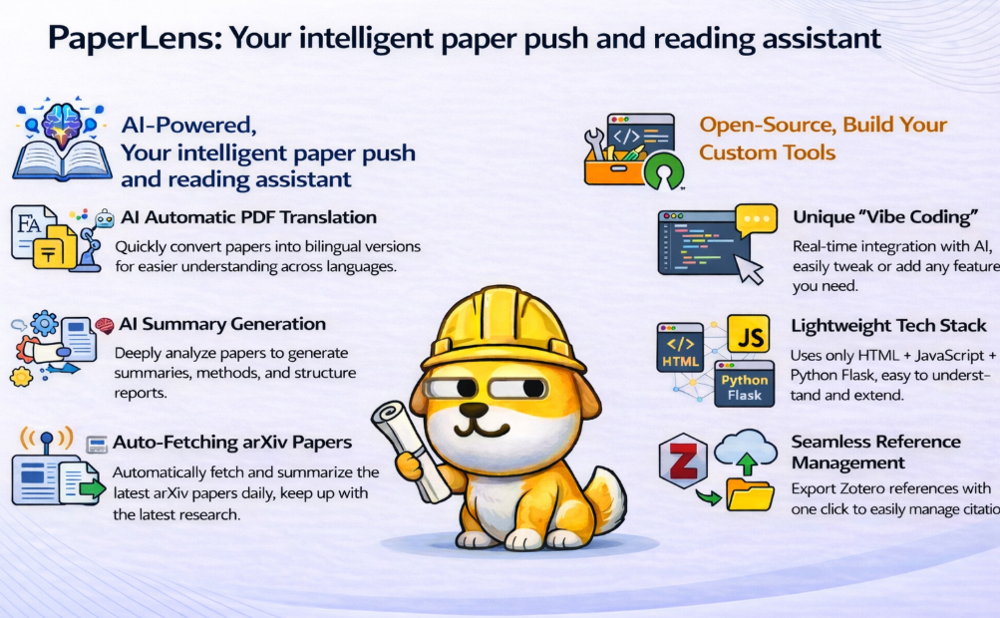
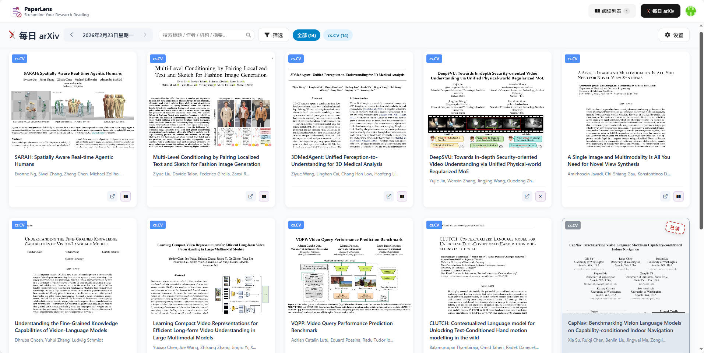
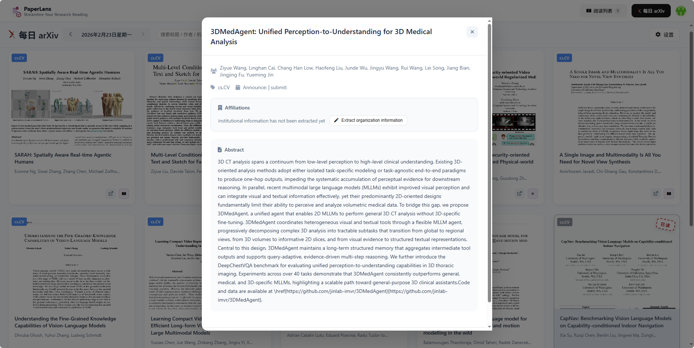
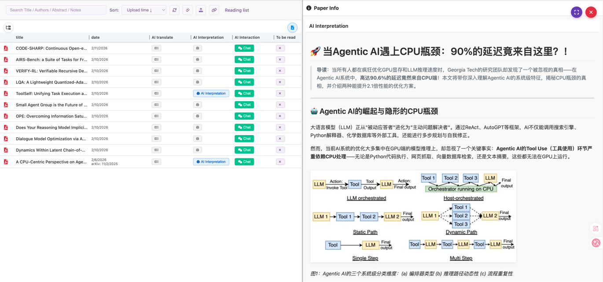
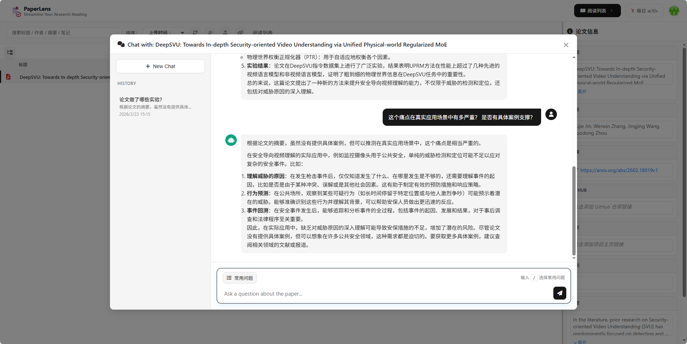
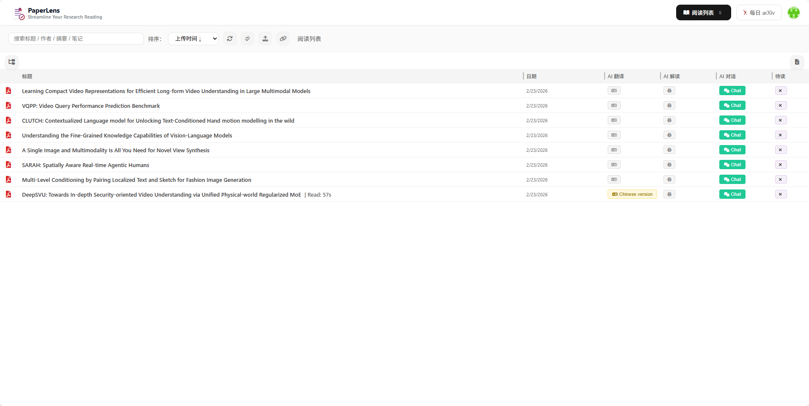
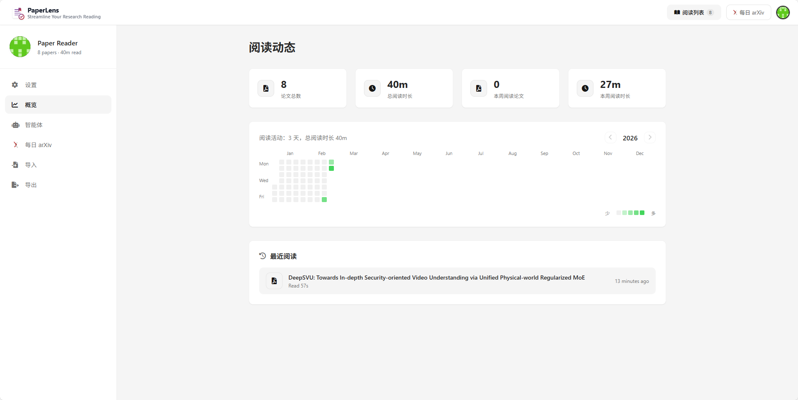
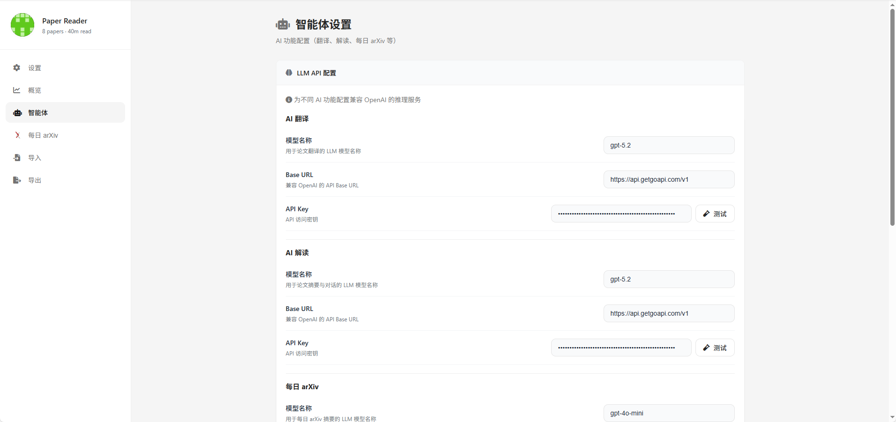
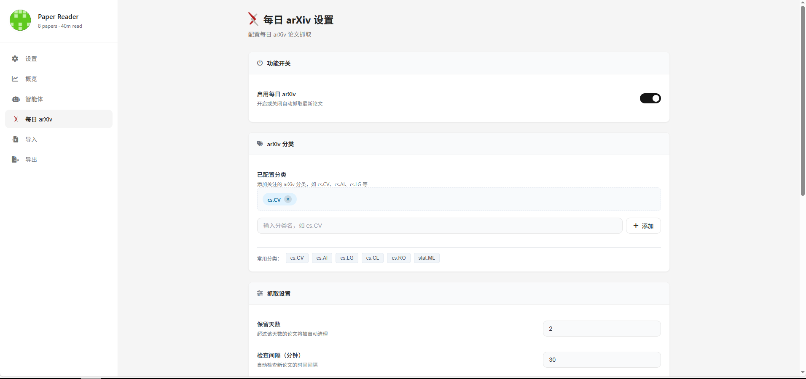

# PaperLens

<div align="center">


**面向可定制论文推送与高效阅读的 AI 原生工具。**

[English](README.md) | [中文](README_zh.md)

</div>

---

## 📖 简介

**PaperLens** 是下一代科研助手，覆盖从发现、理解到整理的完整学术工作流。它结合先进 AI 与可靠的文档管理，助你更快、更省力地发现、阅读、理解和管理论文。

无论你是追踪最新 ArXiv 预印本还是精读复杂 PDF，PaperLens 都能作为你的智能副驾驶。

> **Note**：本项目大部分前端代码在 **Cursor** 的协助下完成，让我以远超预期的速度做出了可用的前端。🤯  
> 距离上次写前端代码已经很久了（上一次还是本科做小程序的时候）。

## ✨ 核心功能



### 📚 智能论文管理
- **无缝上传**：拖拽上传 PDF，自动提取元数据。
- **分类整理**：自定义分类、文件夹与全文检索。
- **Zotero 集成**：从 Zotero RDF 库一键导入。
- **阅读热力图**：用 GitHub 风格的贡献图可视化阅读习惯。

### 🤖 AI 阅读助手
- **AI 翻译**：基于 **BabelDOC** 实现像素级英中（及多语种）翻译，保留原版式与图表。
- **AI 解读**：基于 **MinerU**（PDF 转 Markdown）与 LLM 对论文深度分析，生成结构化摘要（摘要、方法、实验、结论）。
- **与论文对话**：对文档进行交互式问答，厘清概念与细节。

### 📡 Daily ArXiv 雷达
- **自动追踪**：按日抓取指定 ArXiv 分类（如 `cs.CV`、`cs.AI`）的最新论文。
- **智能筛选**：按关键词、机构权重等过滤与高亮。
- **AI 摘要**：为新论文自动生成简明摘要。
- **离线可用**：无 LLM 时也可抓取（仅跳过摘要/机构信息）。

## 📸 功能展示

### 📡 Daily ArXiv 追踪
每日自动抓取论文并生成 AI 摘要，助你紧跟前沿。
<div align="center">
  
  
</div>

### 🤖 AI 解读与对话
基于全文的深度分析与交互式问答，打破语言与理解障碍。
<div align="center">
  
  
</div>

### 📚 管理与配置
阅读列表管理与灵活的系统配置。
<div align="center">
  
  
</div>

<div align="center">
  
  
</div>

## 🛠️ 技术栈

- **后端**：Python 3.10+，Flask
- **前端**：HTML5、CSS3、原生 JS（响应式）
- **数据库**：SQLite（元数据）、Supabase（可选鉴权）
- **AI 核心**：
  - [MinerU](https://github.com/opendatalab/MinerU)（高保真 PDF 解析）
  - [BabelDOC](https://github.com/funstory-ai/BabelDOC)（文档翻译）

## 🚀 安装

推荐使用 [uv](https://github.com/astral-sh/uv) 进行快速、可靠的依赖管理。

### 前置要求
- Python 3.10 或更高
- 包管理器 `uv`

### 步骤

1. **克隆仓库**
   ```bash
   git clone https://github.com/sumarilkkxx/PaperLens
   cd PaperLens
   ```

2. **初始化环境**
   ```bash
   uv venv
   source .venv/bin/activate  # Linux/macOS
   # .venv\Scripts\activate   # Windows
   ```

3. **安装依赖**
   
   **选项 A：标准版（仅客户端）**  
   适用于使用外部 API 完成 AI 任务的场景。
   ```bash
   uv pip install -e ".[local]"
   ```

   **选项 B：完整服务端（本地 AI）**  
   包含本地 MinerU 与 VLM 推理所需依赖。
   ```bash
   uv pip install -e ".[server]"
   ```

4. **Supabase 鉴权（可选）**  
   PaperLens 的登录/注册基于 Supabase Auth（邮箱+密码）。启用后，前端在浏览器中通过 `supabase-js` 获取会话令牌，并在请求 `/api/*` 时附带 `Authorization: Bearer <access_token>`；后端通过 Supabase 的 `/auth/v1/user` 校验令牌。  
   若未配置 `SUPABASE_URL` 与 `SUPABASE_ANON_KEY`，则默认关闭鉴权：不显示登录浮层，且 `/api/*` 不要求 `Authorization` 头，可直接进入管理界面。

   1) 创建 Supabase 项目并获取 API 信息  
   - 在 https://supabase.com/ 创建项目  
   - 在控制台打开 **Project Settings → API**  
   - 将 **Project URL** 复制为 `SUPABASE_URL`  
   - 将 **Project API keys → anon public** 复制为 `SUPABASE_ANON_KEY`  

   2) 启用 Email 鉴权  
   - 进入 **Authentication → Providers**  
   - 启用 **Email**（Email/Password）  
   - 若为本地/私有部署，可在 **Authentication → Settings** 中关闭邮箱确认，避免注册后必须验证邮件  

   3) 配置重定向 URL（重要）  
   - 进入 **Authentication → URL Configuration**  
   - 将 **Site URL** 设为站点根地址，例如：  
   - 本地：`http://localhost:7191`  
   - 生产：`https://your-domain.com`  
   - 在 **Redirect URLs** 中至少加入站点根地址，例如：  
   - `http://localhost:7191/`  
   - `https://your-domain.com/`  

   4) 在 PaperLens 中启用鉴权  
   在项目根目录复制并编辑环境变量：  
   ```bash
   cp .env.example .env
   # 编辑 .env，填入 SUPABASE_URL 和 SUPABASE_ANON_KEY
   ```  
   重启服务后，若配置正确，页面将出现登录/注册入口。

   **安全说明**  
   - 仅使用 `anon public` 密钥；切勿将 `service_role` 写入 `.env` 或暴露给前端  
   - 本项目会将 `SUPABASE_URL` 与 `SUPABASE_ANON_KEY` 注入页面以供浏览器端登录，此为预期行为  

5. **运行应用**

   然后启动应用：  
   ```bash
   python app.py
   ```  
   在浏览器访问 `http://localhost:7191`（默认端口）。

   **自定义启动参数：**  
   `app.py` 支持以下命令行参数：

   | 参数 | 默认值 | 说明 |
   | :--- | :--- | :--- |
   | `--papers-dir` | `./papers` | 论文存储目录（绝对或相对路径） |
   | `--host` | `0.0.0.0` | 服务监听地址 |
   | `--port` | `7191` | 服务监听端口 |
   | `--debug` | `False` | 启用调试模式（开发用） |

   **典型配置示例：**

   - **指定数据存储位置**（适用于挂载数据卷）：  
     ```bash
     python app.py --papers-dir /mnt/data/my_papers
     ```

   - **修改服务端口**（默认端口被占用时）：  
     ```bash
     python app.py --port 8080
     ```

   - **仅允许本机访问**（提高安全性）：  
     ```bash
     python app.py --host 127.0.0.1
     ```

## ⚙️ 配置

### Agentic 设置
在 **Settings** 标签页中配置：  
- **LLM 提供商**：设置 API Key、Base URL 与模型名称（如 GPT-5.2、Gemini-3-pro、DeepSeek）。  
- **MinerU**：选择本地实例或云端 API。

### Daily ArXiv
配置研究关注点：  
- **分类**：选择要监控的 ArXiv 分类。  
- **关键词**：用于过滤与高亮的关键词。  
- **计划**：设置自动抓取间隔。

## ⚠️ 重要说明

- **多用户支持**：当前版本面向个人或小团队，尚未完全支持多租户。虽支持通过 Supabase 鉴权，但所有用户共享同一套后端配置与论文库。建议在私有网络或可信环境中部署。  
- **BabelDOC 翻译**：基于 BabelDOC 的英中对照翻译内存占用高、耗时长，建议仅在需要精读的论文上使用。

## 🗺️ 路线图

### 近期（Next）
- [ ] 阅读标注：高亮、批注、书签与一键引用片段
- [ ] 库体验优化：更好搜索、筛选（标签/作者/会议）与智能排序
- [ ] 导入流程：更快的 PDF 摄入、元数据自动补全与去重
- [ ] 阅读体验：更流畅的阅读器、快捷键与分页优化
- [ ] 部署与运维：Docker Compose、自动备份/恢复与健康检查

### 长期（Future）
- [ ] 前端重构：使用 **React** + **shadcn/ui** 重建 UI，提升一致性与观感
- [ ] RAG 与索引升级：混合检索（BM25 + 向量）、更好分块与更快检索
- [ ] 个人研究工作区：项目、阅读列表、目标与进度追踪
- [ ] 导出与集成：BibTeX/EndNote/Markdown 导出，Obsidian/Notion 友好格式与 API/Webhooks
- [ ] 质量与可靠性：缓存、增量索引、可观测性（日志/指标/追踪）与压测

## 📄 许可证

本项目采用 **CC BY-NC 4.0** 许可证。详见 [LICENSE](LICENSE) 文件。

---

